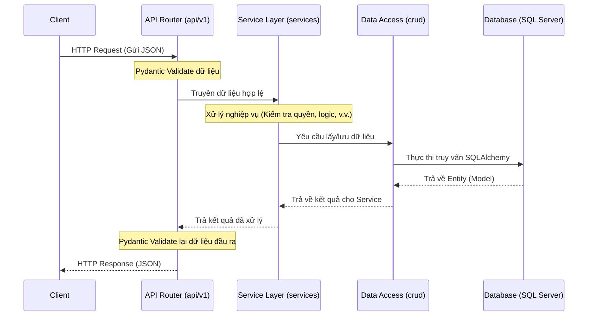

# Kiến Trúc Dự Án FastAPI

Tài liệu này mô tả chi tiết cấu trúc thư mục, chức năng của từng thành phần, luồng xử lý dữ liệu và hướng dẫn tiêu chuẩn để lập trình thêm các tính năng mới vào dự án.

---

## 1. Cấu Trúc Cây Thư Mục & Chức Năng

```text
my_fastapi_project/
├── app/                        
│   ├── api/                    # Tầng Giao Tiếp (Router/Controller)
│   │   ├── dependencies.py     # Nơi tiêm các Dependency (ví dụ: cấp Database Session, xác thực User)
│   │   └── v1/                 # API Phiên bản 1
│   │       ├── endpoints/      # Các file định tuyến API (VD: users.py, items.py). Chỉ nhận Request và trả Response.
│   │       └── api.py          # Gom tất cả các router lẻ lại thành một Router tổng.
│   │
│   ├── core/                   # Cấu Hình Hệ Thống
│   │   ├── config.py           # Đọc file .env, lưu các hằng số cài đặt chung.
│   │   ├── security.py         # Các hàm mã hóa mật khẩu, tạo token JWT.
│   │   └── exceptions.py       # Định nghĩa các lỗi (Exception) để trả về HTTP status code tương ứng.
│   │
│   ├── models/                 # Database Models (SQLAlchemy)
│   │   ├── base.py             # Lớp cơ sở (Base Class) cho mọi model.
│   │   └── user.py             # File ánh xạ 1-1 với bảng trong SQL Server.
│   │
│   ├── schemas/                # Data Transfer Objects (Pydantic DTOs)
│   │   ├── user.py             # Validate dữ liệu từ Client gửi lên, định dạng dữ liệu trả về.
│   │   └── token.py            # Format cho Token.
│   │
│   ├── crud/                   # Data Access Layer (Thao tác DB)
│   │   ├── base.py             # Code chuẩn hóa các thao tác TẠO/ĐỌC/SỬA/XÓA để tái sử dụng.
│   │   └── user.py             # Các câu truy vấn riêng biệt cho User.
│   │
│   ├── services/               # Business Logic Layer (Nghiệp Vụ)
│   │   └── user_service.py     # Nơi xử lý logic phức tạp. Tầng này kết nối giữa API và CRUD.
│   │
│   ├── db/                     # Quản Lý Kết Nối Database
│   │   └── session.py          # Chứa `engine` và cấu hình session kết nối tới SQL Server.
│   │
│   ├── utils/                  # Hàm Tiện Ích
│   │
│   └── main.py                 # Điểm khởi chạy của ứng dụng FastAPI.
│
├── .env                        # File chứa bảo mật (Mật khẩu, IP DB) (Không push lên Git).
└── requirements.txt            # Danh sách các thư viện cần cài đặt.
```

---

## 2. Sơ Đồ Luồng Hoạt Động (Data Flow)

Dưới đây là sơ đồ luồng đi của dữ liệu từ khi người dùng bấm gọi API cho đến khi nhận được kết quả trả về:



---

## 3. Quy Tắc Viết Mã Nguồn (Best Practices)

Để code dễ bảo trì và làm việc nhóm hiệu quả, hãy tuân thủ nghiêm ngặt 4 nguyên tắc sau:
1. **Router Cực Mỏng (Thin Controllers)**: File trong `api/v1/endpoints/` CHỈ có trách nhiệm nhận Request, gọi tầng `services` và trả về kết quả. TUYỆT ĐỐI KHÔNG viết if/else xử lý nghiệp vụ hay lệnh SQL ở đây.
2. **Logic Nghiệp Vụ Ở Service**: Tầng `services/` là "bộ não" của ứng dụng. Dữ liệu trước khi được đưa xuống Database hoặc trước khi trả về cho Router phải được xử lý ở đây.
3. **Thao Tác DB Ở CRUD**: Chỉ tầng `crud/` mới được phép import `sqlalchemy` để thực hiện câu query.
4. **Luôn Xác Thực Dữ Liệu**: Mọi dữ liệu đi vào (Body Payload) và đi ra (Response Model) đều phải có class tương ứng trong thư mục `schemas/`.

---

## 4. Ví Dụ Cụ Thể: Quy trình thêm Endpoint "Sản Phẩm" (Product)

Giả sử bạn cần làm một tính năng: **Thêm mới Sản phẩm**. Quá trình lập trình diễn ra theo thứ tự sau:

### Bước 1: Tạo Database Model (`app/models/product.py`)
```python
from sqlalchemy import Column, Integer, String
from app.models.base import Base

class Product(Base):
    __tablename__ = "products"
    id = Column(Integer, primary_key=True, index=True)
    name = Column(String, index=True)
    price = Column(Integer)
```

### Bước 2: Tạo Schema kiểm tra dữ liệu (`app/schemas/product.py`)
```python
from pydantic import BaseModel

class ProductCreate(BaseModel):
    name: str
    price: int

class ProductResponse(BaseModel):
    id: int
    name: str
    price: int
    
    class Config:
        from_attributes = True
```

### Bước 3: Viết tầng truy vấn DB (`app/crud/product.py`)
```python
from sqlalchemy.orm import Session
from app.models.product import Product
from app.schemas.product import ProductCreate

def create_product(db: Session, product: ProductCreate):
    db_obj = Product(name=product.name, price=product.price)
    db.add(db_obj)
    db.commit()
    db.refresh(db_obj)
    return db_obj
```

### Bước 4: Viết Service xử lý nghiệp vụ (`app/services/product_service.py`)
```python
from sqlalchemy.orm import Session
from app.crud import product as crud_product
from app.schemas.product import ProductCreate

def add_new_product(db: Session, product_in: ProductCreate):
    # Bạn có thể thêm if/else ở đây (VD: Kiểm tra tên sản phẩm có bị cấm không?)
    if product_in.price < 0:
         raise ValueError("Giá sản phẩm không được âm!")
         
    return crud_product.create_product(db, product_in)
```

### Bước 5: Viết API Router (`app/api/v1/endpoints/products.py`)
```python
from fastapi import APIRouter, Depends, HTTPException
from sqlalchemy.orm import Session
from app.api import dependencies
from app.schemas.product import ProductCreate, ProductResponse
from app.services import product_service

router = APIRouter()

@router.post("/", response_model=ProductResponse)
def create_product(
    product_in: ProductCreate, 
    db: Session = Depends(dependencies.get_db)
):
    try:
        return product_service.add_new_product(db=db, product_in=product_in)
    except ValueError as e:
        raise HTTPException(status_code=400, detail=str(e))
```

### Bước 6: Khai báo Router vào Hệ thống (`app/api/v1/api.py`)
```python
from app.api.v1.endpoints import products
# Thêm dòng này vào cuối file api.py hiện tại
api_router.include_router(products.router, prefix="/products", tags=["products"])
```

Như vậy là xong! Khi gọi `POST /api/v1/products`, toàn bộ luồng sẽ tự động khớp vào nhau.
